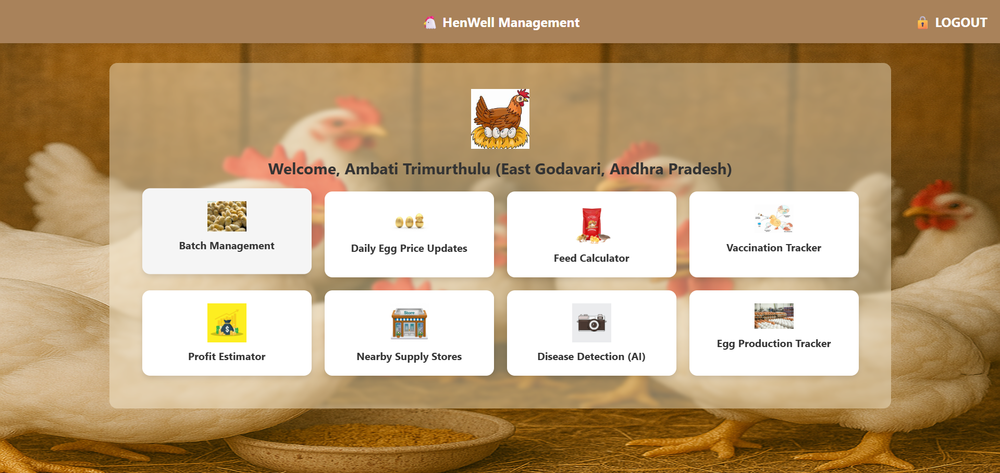
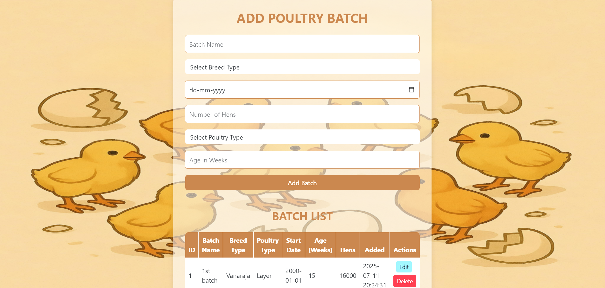
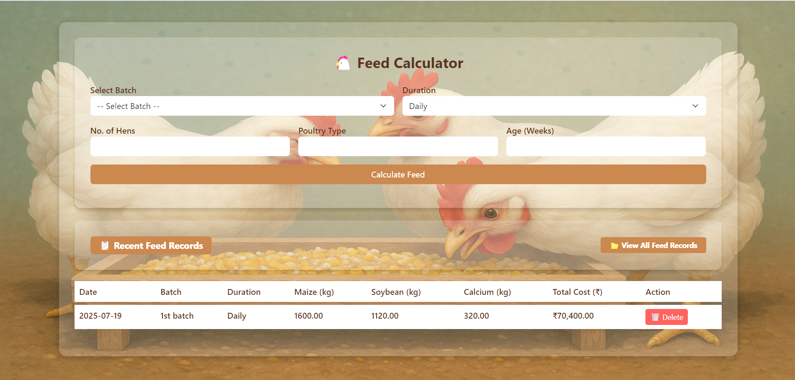
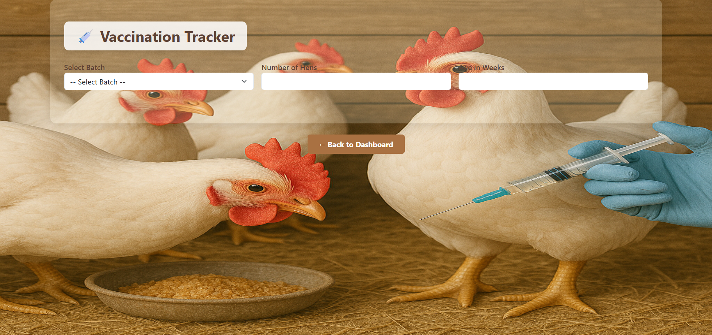
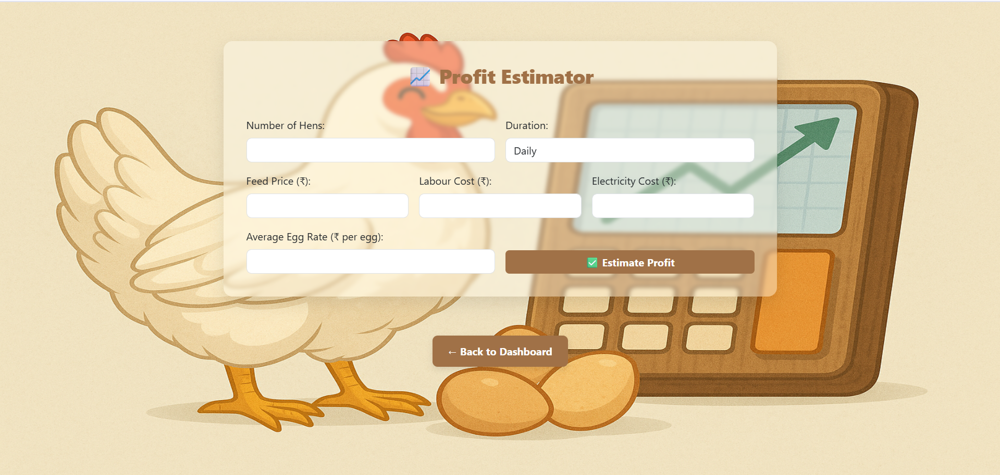
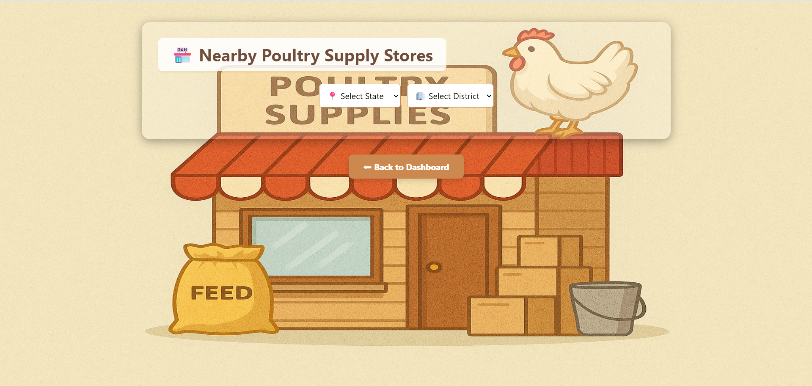
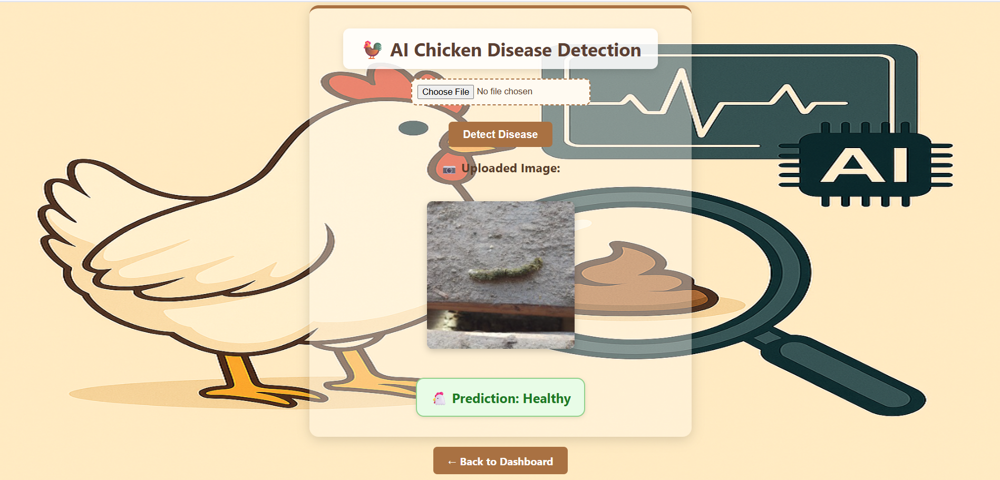
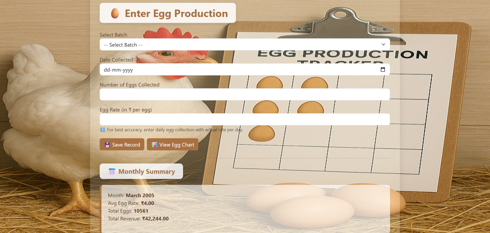

# 🐔 HenWell Poultry Management System

HenWell is a complete poultry management system built with **PHP, MySQL, Bootstrap, and Python (Flask AI)**.  
It helps farmers **manage batches, calculate feed, track egg production, check daily egg prices, vaccination schedules, profits, nearby stores, and even detect poultry diseases using AI.**

---

## ✨ Features  

- 🐔 **Batch Management** – Add, edit, and delete poultry batches (Layer/Broiler)  
- 🥚 **Daily Egg Price Fetcher** – Live egg price updates from an online API  
- 🥦 **Feed Calculator** – Auto-calculate feed quantity & cost based on batch size & duration  
- 💉 **Vaccination Tracker** – Keep track of poultry vaccination schedules  
- 💰 **Profit Estimator** – Calculate monthly profits based on revenue & expenses  
- 📍 **Nearby Supply Stores** – Filter poultry stores by state & district + Google Maps integration  
- 🧠 **AI Disease Detection** – Upload chicken images to detect common diseases via a Flask AI model  
- 📊 **Egg Production Tracker** – Record daily egg production with monthly summary & graph visualization  

---

## 📂 Project Structure  

```
HenWell/
│── assets/               # Background images & icons  
│── uploads/              # Uploaded AI detection images  
│── env/                  # Virtual environment for Python Flask API  
│
│── app.py                # Flask AI API entry point  
│── train_model.py        # AI model training script  
│── train_data.csv        # Sample training dataset  
│── hen_diseases_model.keras   # Trained AI model  
│── label_encoder.pkl     # Label encoder for AI predictions  
│── check_images.py       # Utility for testing AI images  
│
│── dashboard.php         # Main dashboard  
│── registration.php      # User registration  
│── login.php             # User login  
│── logout.php            # User logout  
│── batch_management.php  # Manage poultry batches  
│── edit_batch.php        # Edit an existing batch  
│── delete_batch.php      # Delete a batch  
│
│── feed.php              # Feed calculator page  
│── feed_tracker.php      # View all feed records  
│── save_feed_record.php  # Backend for saving feed records  
│── delete_feed_record.php # Delete a feed record  
│
│── egg_input.php         # Daily egg collection entry  
│── egg_tracker.php       # Graphical egg production tracker  
│── save_egg_production.php # Backend for saving egg records  
│── edit_egg_production.php # Edit an egg production record  
│── delete_egg_production.php # Delete an egg record  
│
│── eggprices.php         # Daily egg price fetcher  
│── vaccine.php           # Vaccination tracker page  
│── profit.php            # Profit estimator page  
│── stores.php            # Nearby poultry supply stores + Google Maps  
│
│── detection.php         # AI-based disease detection (PHP -> Flask API)  
│── db_connection.php     # Database connection  
│
│── README.md             # Project documentation  
│── readme.txt            # Extra notes  
```

---

## 🚀 Tech Stack  

- **Backend:** PHP + MySQL  
- **Frontend:** Bootstrap 5, HTML, CSS, JS  
- **AI Model:** Python (Flask + Keras)  
- **Maps:** Google Maps API  

---

## 🔧 Setup Instructions  

### 1️⃣ Clone the repository  
```bash
git clone https://github.com/YourUsername/HenWell-Poultry-Management.git
cd HenWell-Poultry-Management
```

### 2️⃣ Import Database  
- Create a MySQL database `poultry_db`  
- Import `poultry_db.sql`  

### 3️⃣ Run PHP Project  
- Start **XAMPP**  
- Move project to `htdocs`  
- Visit `http://localhost/HenWell/dashboard.php`  

### 4️⃣ Setup Flask AI Detection  
```bash
cd python-api
python -m venv venv
venv\Scripts\activate   # Windows
source venv/bin/activate # macOS/Linux

pip install -r requirements.txt
python app.py
```
Now AI model runs at `http://127.0.0.1:5000/predict`  

---

## 📸 Screenshots  

### 🏠 Dashboard  
  

### 👤 Registration & Login  
  

### 🐔 Batch Management  
  

### 🥚 Daily Egg Price Fetcher  
  

### 🥦 Feed Calculator  
  

### 💉 Vaccination Tracker  
  

### 💰 Profit Estimator  
  

### 📍 Nearby Supply Stores  
  

### 🧠 AI Disease Detection  
  

### 📊 Egg Production Tracker  
  

---

## 📜 License  
**No License (All Rights Reserved)**  
This repository is for showcasing purposes only.  
You can **view the code but not reuse, copy, or distribute without permission.**  

---

## 🤝 Credits  

**Built by Ambati Venkata Ratna Sowmya**  
📧 Email: **ambatisowmya1535@gmail.com**  

Uses **Google Maps API, Bootstrap 5, Flask AI model, and PHP + MySQL**  

⭐ *If you like this project, give it a star on GitHub!*  
